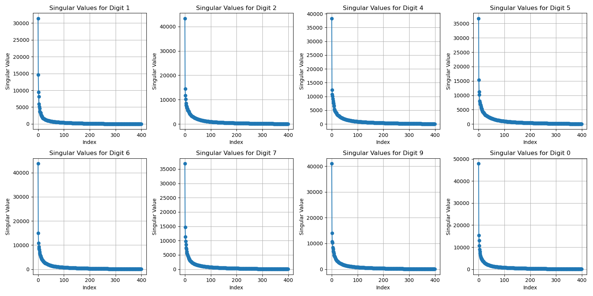
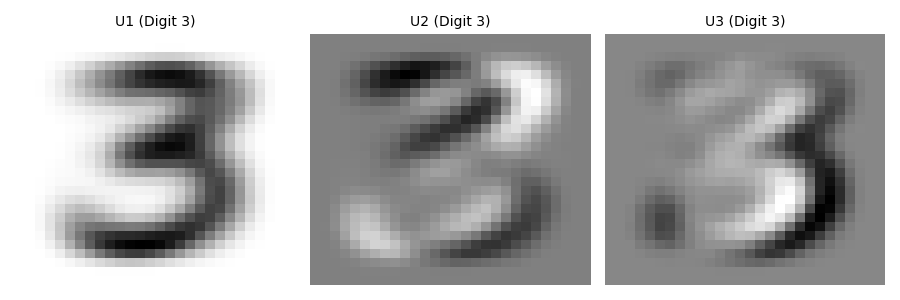
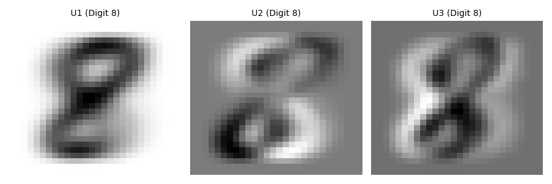
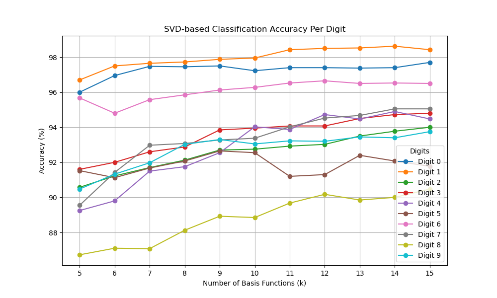
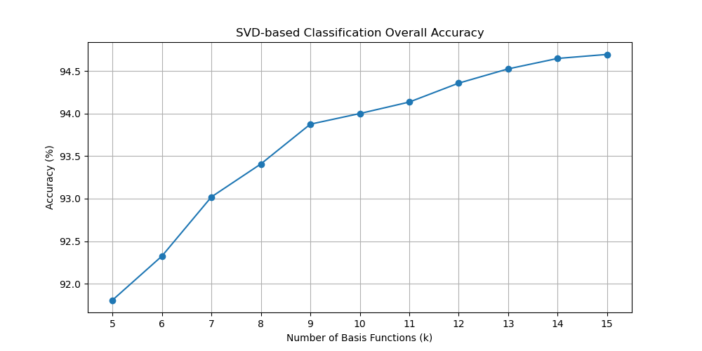

# Handwritten Digit Classification Using Singular Value Decomposition (SVD)

This project demonstrates the use of Singular Value Decomposition (SVD) for classifying handwritten digits using a dataset of 28x28 pixel images. The task focuses on applying SVD to reduce the dimensionality of image data, thereby improving both classification accuracy and computational efficiency.

## 📌 Project Overview

The project explores the process of handwritten digit classification. Using SVD, we decompose digit matrices and then apply this decomposition to classify test images. The classification process relies on projecting images into a lower-dimensional space defined by the significant singular vectors, calculating residuals, and then determining the closest match to classify the image.

### 🔢 Tasks

- **Task 1**: Explanation of SVD-based digit representation and classification through residuals.
- **Task 2**: Analysis of singular values for digits 3 and 8 and visualizations of the singular vectors.
- **Task 3**: Comprehensive classification across all digits, with results on classification accuracy based on the number of basis functions used.

## 💻 Requirements

- Python 3.x  
- NumPy  
- Matplotlib  
- SciPy  

## ⚙️ Installation

To run the project, clone the repository and install the required dependencies:

```bash
git clone https://github.com/Ruichen0508/HandwrittenDigits.git
cd HandwrittenDigits
```

### 📁 Data

The dataset should consist of the following files:

- `TrainDigits.npy`
- `TrainLabels.npy`
- `TestDigits.npy`
- `TestLabels.npy`

These contain the training and test images and labels for the classification task.

### 🔬 SVD Calculation

For each digit, we perform Singular Value Decomposition (SVD) on the training matrix and retain the most significant singular values for classification.

### 🧠 Classification

After performing SVD, we classify the test images by projecting them onto the subspace defined by the top K singular vectors and computing the residuals.

### ▶️ Run the Code

Execute the provided Python scripts to preprocess data, calculate SVD, and classify test images. Results will include accuracy metrics and visualizations.

```bash
python main.py
```

## 📈 Results

- The classification accuracy improves as more singular values are retained.
- The first few singular values capture the most important features of the digits.
- Increasing the number of singular values improves accuracy, but only up to a point.

## 🗂️ Code Structure

- `svd_classification.py`: Main script for performing SVD on digit images and classifying the test set.
- `visualization.py`: Functions to plot singular values and images of singular vectors.
- `requirements.txt`: Dependencies for the project.
- `README.md`: Project documentation.

## 🧪 Results and Discussion

- **Accuracy**: Achieves around 94.5% accuracy with optimal parameters. Digits like '1' are easier to classify, while digits like '8' are more challenging.
- **Efficiency**: SVD helps reduce dimensionality and improve computational speed.
- **Further Work**: Try other dimensionality reduction techniques or advanced ML models to enhance accuracy.

1. **Singular Value Plot**  
   A plot showing how the singular values decrease with increasing index. This demonstrates how much variance each singular value explains in the digit images.  
   

2. **Singular Value Images for Digits 3 and 8**  
   Here are visualizations of the singular value images for digits 3 and 8. These images represent the most significant features captured by the first few singular vectors.  
     
   
   
3. **SVD-based Classification Accuracy Per Digit**  
   The accuracy of classification for each digit as a function of the number of singular values retained.  
   

4. **Overall Classification Accuracy**  
   The classification accuracy across all digits as a function of the number of singular values retained.  
   

---
